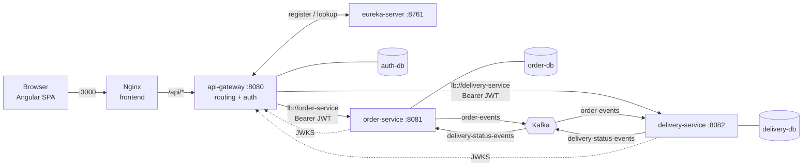
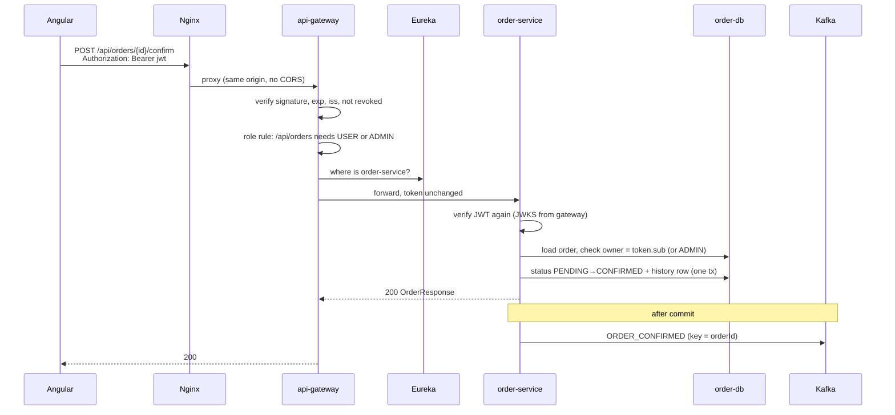
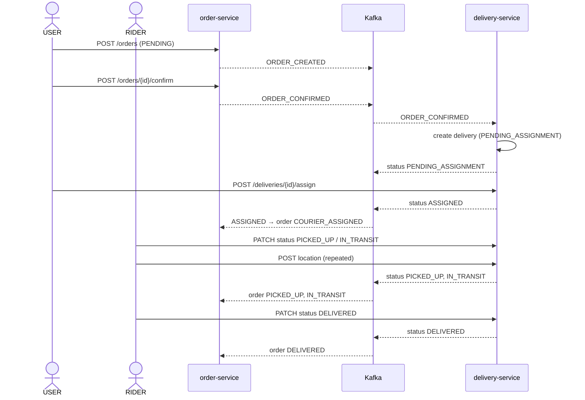
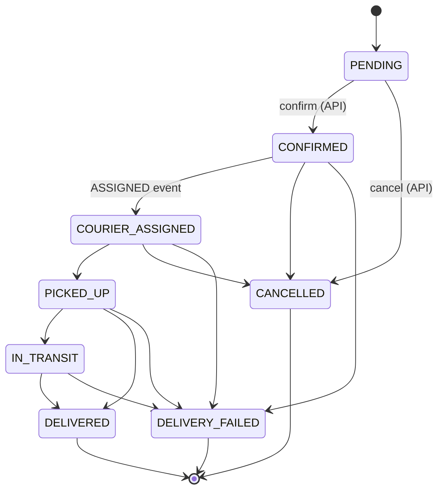
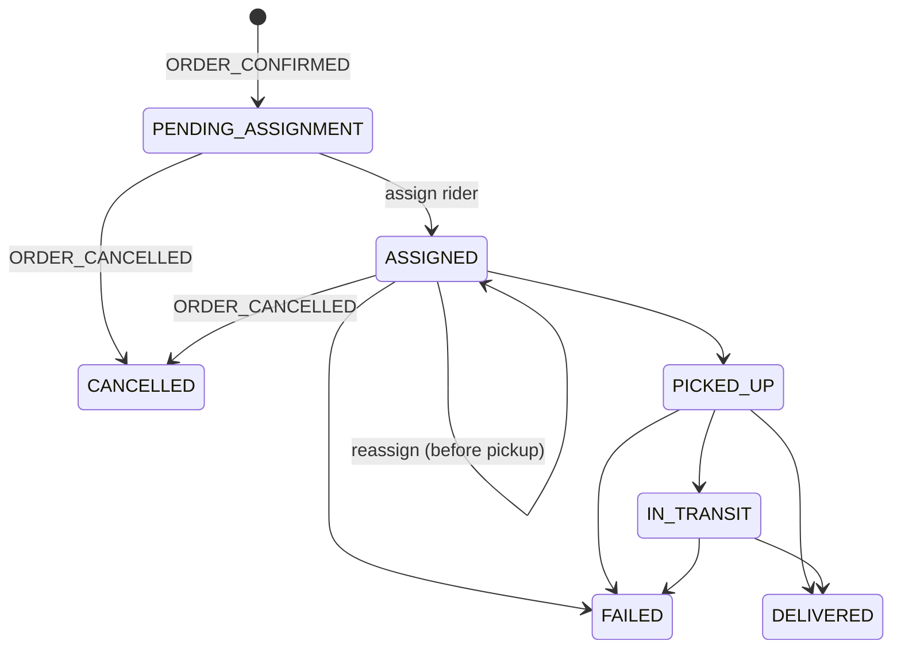

# TrackFlow: Technical Architecture

This document is for developers working on TrackFlow. It explains how the system is put together, why it is built that way, and how to change it safely. For a quick start, see the [README](../README.md).

**Contents**

1. [System overview](#1-system-overview)
2. [Runtime topology](#2-runtime-topology)
3. [Request lifecycle](#3-request-lifecycle)
4. [Authentication and authorization](#4-authentication-and-authorization)
5. [Event-driven flow](#5-event-driven-flow)
6. [Domain model and state machines](#6-domain-model-and-state-machines)
7. [Data stores](#7-data-stores)
8. [Service internals](#8-service-internals)
9. [Frontend architecture](#9-frontend-architecture)
10. [Error handling](#10-error-handling)
11. [Configuration reference](#11-configuration-reference)
12. [Build, run and debug](#12-build-run-and-debug)
13. [Testing](#13-testing)
14. [Making changes safely](#14-making-changes-safely)
15. [Known limitations and next steps](#15-known-limitations-and-next-steps)

---

## 1. System overview

TrackFlow manages orders from checkout to doorstep. Three roles use it:

| Role | Does |
|---|---|
| **USER** (customer) | Checks out orders, confirms or cancels them, picks a rider for each delivery, follows it live |
| **RIDER** | Carries the deliveries assigned to them, updates their status, shares GPS location |
| **ADMIN** | Sees and does everything, manages riders and user accounts |

Architecturally it is a set of **independent services that own their data and talk through Kafka events**. The only synchronous traffic is browser → gateway → one service. Services never call each other.

| Concern | Technology |
|---|---|
| Language / runtime | Java 21 |
| Framework | Spring Boot 4.0.8, Spring Cloud 2025.1.3 |
| Edge | Spring Cloud Gateway **Server MVC** (servlet) + Spring Security 7 |
| Discovery | Netflix Eureka |
| Messaging | Apache Kafka 4.1 (KRaft mode, no ZooKeeper), Spring for Apache Kafka 4 |
| Persistence | PostgreSQL 17, Spring Data JPA / Hibernate 7, Flyway |
| Serialization | Jackson 3 (`tools.jackson.*`) |
| Tokens | RS256 JWTs via Nimbus JOSE (Spring Security OAuth2 resource server) |
| Frontend | Angular 22 (standalone, signals, `httpResource`, zoneless-ready), Leaflet maps |
| Packaging | Multi-stage Docker images, Docker Compose |

---

## 2. Runtime topology



| Container | Image | Host port | Notes |
|---|---|---|---|
| `trackflow-frontend` | built from `frontend/` | 3000 | Nginx serves the SPA and proxies `/api/` to the gateway |
| `trackflow-gateway` | built from `backend/api-gateway` | 8080 | The only API entry point |
| `trackflow-eureka` | built from `backend/eureka-server` | 8761 | Dashboard at `/` |
| `trackflow-order-service` | built from `backend/order-service` | **none** | Reachable only on the Compose network |
| `trackflow-delivery-service` | built from `backend/delivery-service` | **none** | Reachable only on the Compose network |
| `trackflow-kafka` | `apache/kafka:4.1.0` | 9094 | `kafka:9092` inside, `localhost:9094` from the host |
| `trackflow-auth-db` | `postgres:17-alpine` | 15435 | Users, roles, signing keys, revoked tokens |
| `trackflow-order-db` | `postgres:17-alpine` | 15433 | Orders |
| `trackflow-delivery-db` | `postgres:17-alpine` | 15434 | Deliveries, riders, GPS points |
| `trackflow-kafka-ui` | `ghcr.io/kafbat/kafka-ui` | 8090 | Optional, `--profile tools` |

Postgres host ports avoid 5433–5532, which Windows/Hyper-V commonly reserves.

**Startup order** is enforced with health checks (`depends_on: condition: service_healthy`):

```
postgres ×3, kafka, eureka  →  api-gateway  →  frontend
postgres, kafka, eureka     →  order-service, delivery-service
```

The JRE images have no `curl`, so Spring health checks query `/actuator/health` over a raw bash `/dev/tcp` socket. After a service starts, the gateway may need up to ~30 s to see it in Eureka; until then it answers **503**.

---

## 3. Request lifecycle

Example: a customer confirms their order.



Every request also gets an `X-Request-Id` (generated by the gateway if absent), echoed in the response and logged on one line per request by `RequestIdFilter`.

---

## 4. Authentication and authorization

### 4.1 Design

The gateway is both **token issuer** (login) and **resource server** (checks tokens). The business services are resource servers only.

| Job | Where | Why |
|---|---|---|
| Store users, roles, password hashes | gateway (`auth-db`) | One owner for identity data |
| Issue tokens | gateway (`TokenService`) | Login happens once per session |
| Reject unauthenticated requests | gateway | Nothing unauthenticated reaches a service |
| Coarse role rules (which API at all) | gateway (`SecurityConfig`) | Fail fast at the edge |
| Fine rules (is this *yours*?) | each service | Only the service knows who owns its data |
| Verify the token again | each service | Defence in depth; no trust in "it came through the gateway" |

### 4.2 Tokens

- **Format**: JWT, signed **RS256**, header carries `kid`.
- **Lifetime**: 2 hours (`AUTH_TOKEN_TTL`).
- **Claims**:

```json
{
  "iss": "trackflow-gateway",
  "sub": "grace",
  "jti": "5c1f…",
  "iat": 1790000000,
  "exp": 1790007200,
  "name": "Grace Hopper",
  "roles": ["USER"]
}
```

- **Mapping to Spring authorities**: the `roles` claim becomes `ROLE_<name>` (gateway: `JwtGrantedAuthoritiesConverter`; services: `authorities-claim-name: roles`, `authority-prefix: ROLE_`).
- **Signing key**: a 2048-bit RSA pair generated on first start and **stored in `auth-db.signing_keys`** (`SigningKeys`), so tokens survive restarts and all gateway replicas share it. Only the public half is published at `GET /.well-known/jwks.json`.
- **Verification in services**: `spring.security.oauth2.resourceserver.jwt.jwk-set-uri` points to the gateway's JWKS. Nimbus fetches it lazily and caches it, re-fetching when it sees an unknown `kid`. `issuer-uri` is set, so the `iss` claim is validated (no discovery call is made because `jwk-set-uri` is also set).

### 4.3 Login, registration, logout

| Endpoint | Behaviour |
|---|---|
| `POST /api/auth/login` | Looks up the user, compares the password with the BCrypt hash. Unknown users are compared against a dummy hash so timing doesn't reveal which usernames exist. Disabled users and wrong passwords get the same 401 message. |
| `POST /api/auth/register` | Public. Always creates a **USER**. Usernames are normalised to lower case. |
| `POST /api/auth/logout` | Stores the token's `jti` and `exp` in `revoked_tokens`. The gateway's `RevokedTokenValidator` rejects it from then on. An hourly job deletes rows past their expiry. |
| `GET /api/auth/me` | The current account. |

Passwords use `PasswordEncoderFactories.createDelegatingPasswordEncoder()`, which stores `{bcrypt}$2a$…` so the algorithm can be upgraded later.

> **Revocation scope**: only the gateway checks `revoked_tokens`. Since the services are not reachable from outside the Compose network, that is the effective enforcement point.

### 4.4 Authorization matrix

Gateway rules (`api-gateway/.../SecurityConfig`), evaluated top to bottom:

| Path | Rule |
|---|---|
| `POST /api/auth/login`, `POST /api/auth/register` | public |
| `/.well-known/jwks.json`, `/actuator/health/**`, `/actuator/info`, `/error` | public |
| `/api/auth/users/**` | ADMIN |
| `GET /api/couriers/**` | ADMIN, USER |
| other `/api/couriers/**` | ADMIN |
| `/api/orders/**` | ADMIN, USER |
| everything else (incl. `/api/deliveries/**`) | authenticated |

Service rules:

| Action | ADMIN | USER | RIDER |
|---|---|---|---|
| Create order | ✓ | ✓ (owner = self) | ✗ |
| View / confirm / cancel order | all | own | ✗ |
| List deliveries | all | of own orders | assigned to self |
| View delivery, GPS trail | all | of own orders | assigned to self |
| Assign rider | ✓ | own, before pickup | ✗ |
| Update delivery status | ✓ | ✗ | assigned to self |
| Report location | ✓ | ✗ | assigned to self |
| List riders | ✓ | ✓ | ✗ |
| Add rider profile | ✓ | ✗ | ✗ |

Implementation:

- **order-service**: `@PreAuthorize("hasAnyRole('USER','ADMIN')")` on `OrderController`. `OrderService.load(id, user)` filters by `CurrentUser.canAccessOrderOf(owner)`.
- **delivery-service**: rules live in `security/CurrentUser` (`canView`, `canAssign`, `canDrive`), which checks the **role as well as the name**. A RIDER called `grace` is not the customer `grace`. `DeliveryService.loadVisible` turns "can't view" into 404. "Can view but not do" throws `AccessDeniedException`, which becomes 403.

**Hiding versus forbidding**: a resource you may not see returns **404**, never 403, so ids can't be probed. A resource you may see but not change returns **403**.

### 4.5 Linking riders to logins

A rider exists in two services:

| Record | Service | Key |
|---|---|---|
| Login account (role RIDER) | gateway `users` | `username` |
| Courier profile (vehicle, location, availability) | delivery-service `couriers` | `username` (unique) |

They are joined by `username`, which is the token's `sub`. The admin "Add rider" form creates the account (`POST /api/auth/users`) and then the profile (`POST /api/couriers`). With a blank password it only creates the profile, linking an existing RIDER account. The demo riders are linked by migration `V3__add_ownership.sql` and `DemoUserSeeder`.

---

## 5. Event-driven flow

### 5.1 Topics

| Topic | Producer | Consumer (group) | Key | Partitions |
|---|---|---|---|---|
| `order-events` | order-service | delivery-service (`delivery-service`) | `orderId` | 3 |
| `delivery-status-events` | delivery-service | order-service (`order-service`) | `orderId` | 3 |

Both services declare both topics as `NewTopic` beans, so whichever starts first creates them. Values are JSON strings (`StringSerializer` plus Jackson 3 `JsonMapper`), deliberately without Spring's type headers, so neither side needs the other's Java class names.

### 5.2 Event contracts

`order-events` (`OrderEvent`):

```json
{
  "eventId": "uuid",
  "eventType": "ORDER_CREATED | ORDER_CONFIRMED | ORDER_CANCELLED",
  "orderId": "uuid",
  "orderNumber": "TF-KHCXSX",
  "customerUsername": "grace",
  "customerName": "Grace Hopper",
  "customerPhone": "+44 7700 900200",
  "deliveryAddress": "221B Baker Street, London",
  "totalAmount": 98.99,
  "status": "CONFIRMED",
  "occurredAt": "2026-10-02T18:41:30Z"
}
```

`delivery-status-events` (`DeliveryStatusEvent`):

```json
{
  "eventId": "uuid",
  "deliveryId": "uuid",
  "orderId": "uuid",
  "status": "PENDING_ASSIGNMENT | ASSIGNED | PICKED_UP | IN_TRANSIT | DELIVERED | FAILED | CANCELLED",
  "courierId": "uuid or null",
  "courierName": "Amara Okafor or null",
  "note": "free text or null",
  "occurredAt": "2026-10-02T18:41:31Z"
}
```

Each service keeps **its own copy** of these records (no shared library). Jackson 3 ignores unknown properties by default, and `status` is consumed as a string, so producers can add fields or statuses without breaking consumers.

### 5.3 End-to-end sequence



**Cancellation**: `ORDER_CANCELLED` makes delivery-service cancel the delivery and free the rider, but only while it is `PENDING_ASSIGNMENT` or `ASSIGNED`. After pickup it logs a warning and leaves the delivery running (see §15).

**Auto-assign** (`TRACKFLOW_DELIVERY_AUTO_ASSIGN=true`, default `false`): on `ORDER_CONFIRMED`, delivery-service assigns the available rider idle the longest (`CourierRepository.findNextAvailable`, ordered by `last_assigned_at NULLS FIRST`).

### 5.4 Delivery guarantees

| Concern | Mechanism | Where |
|---|---|---|
| No event for a rolled-back change | Services publish a Spring application event inside the transaction; a `@TransactionalEventListener(AFTER_COMMIT)` sends it to Kafka | `OrderEventPublisher`, `DeliveryEventPublisher` |
| Per-order ordering | Key = `orderId` → same partition | publishers |
| Producer durability | `acks=all`, idempotent producer (Kafka default) | `application.yml` |
| Duplicates / replays | Consumers are idempotent: delivery creation checks `existsByOrderId` (plus a unique constraint); order status only moves forward, so stale or duplicate events are logged and skipped | `DeliveryService.createForConfirmedOrder`, `OrderService.applyDeliveryStatus` |
| Transient failures | `DefaultErrorHandler`: 3 retries, 1 s apart | `KafkaConfig` |
| Poison messages | After retries, `DeadLetterPublishingRecoverer` sends the record to the topic's dead-letter topic; `JacksonException` is not retried | `KafkaConfig` |
| Concurrent writers | `@Version` on `Order`, `Delivery`, `Courier`; a lost race in a listener is retried by the error handler | entities |

**Gap**: a crash after the DB commit but before the Kafka send loses that event. See §15.

---

## 6. Domain model and state machines

### 6.1 Order (`order-service`)



`OrderStatus.allowedNext()` is the source of truth. Event-driven transitions may **skip forward** (e.g. `CONFIRMED → IN_TRANSIT` if `PICKED_UP` was missed) but never go back. That is what makes replays safe. A forbidden transition through the API returns **409**; through an event it is skipped.

Delivery status to order status (`DeliveryStatusMapping`): `ASSIGNED→COURIER_ASSIGNED`, `PICKED_UP→PICKED_UP`, `IN_TRANSIT→IN_TRANSIT`, `DELIVERED→DELIVERED`, `FAILED→DELIVERY_FAILED`. `PENDING_ASSIGNMENT` and `CANCELLED` have no order-level effect.

Every change writes an `order_status_history` row with `source = API | DELIVERY_EVENT`. The UI shows this as the timeline.

### 6.2 Delivery (`delivery-service`)



Rules in `Delivery`:

- `assign(courier)`: only before pickup, only if the courier is `available`. It frees the previous rider and marks the new one busy.
- `transitionTo(status)`: validated by `DeliveryStatus.allowedNext()`. It sets `pickedUpAt` / `deliveredAt`, and frees the rider on any terminal status.
- Through the API, only `PICKED_UP`, `IN_TRANSIT`, `DELIVERED` and `FAILED` can be set directly. Assignment and cancellation have their own paths.
- Location pings are accepted only in `ASSIGNED`, `PICKED_UP` or `IN_TRANSIT`. They also update the rider's current position.

---

## 7. Data stores

Schemas are owned by **Flyway** (`src/main/resources/db/migration`). Hibernate runs with `ddl-auto: validate`.

### 7.1 `auth-db` (api-gateway)

| Table | Purpose | Notable columns |
|---|---|---|
| `roles` | The three roles | `name` PK (`ADMIN`, `USER`, `RIDER`), `description` |
| `users` | Accounts | `username` unique, `password_hash`, `display_name`, `role` FK→roles, `enabled` |
| `signing_keys` | RSA key pair | `kid` PK, Base64 X.509 public / PKCS#8 private |
| `revoked_tokens` | Logged-out tokens | `jti` PK, `expires_at` (indexed for cleanup) |

### 7.2 `order-db` (order-service)

| Table | Purpose | Notable columns |
|---|---|---|
| `orders` | Order header | `order_number` unique (`TF-XXXXXX`), `customer_username`, `total_amount numeric(12,2)`, `status`, `version` |
| `order_items` | Line items (`@ElementCollection`) | PK (`order_id`, `line_no`), `quantity > 0`, `unit_price > 0` |
| `order_status_history` | Audit trail | `status`, `source`, `note`, `changed_at` |

Migrations: `V1__create_orders.sql`, `V2__add_order_owner.sql`.

### 7.3 `delivery-db` (delivery-service)

| Table | Purpose | Notable columns |
|---|---|---|
| `couriers` | Rider profiles | `username` unique, `vehicle_type`, `available`, `current_latitude/longitude`, `last_assigned_at`, `version` |
| `deliveries` | One per confirmed order | `order_id` **unique** (idempotency), snapshot of customer/address, `customer_username`, `status`, `courier_id` FK, timestamps |
| `delivery_location_updates` | GPS trail | `delivery_id`, `courier_id`, `latitude`, `longitude`, `recorded_at` |

Migrations: `V1__create_deliveries.sql`, `V2__seed_couriers.sql`, `V3__add_ownership.sql`.

Deliveries **copy** the order data they need from the event. delivery-service never reads `order-db` and never calls order-service.

Rows created before authentication existed have `NULL` owners and are visible to ADMIN only.

---

## 8. Service internals

### 8.1 api-gateway

```
com.trackflow.gateway
├── ApiGatewayApplication          @EnableScheduling (revoked-token cleanup)
├── routing/
│   ├── GatewayRoutes              Java-DSL routes: path → lb("<service>")
│   └── RequestIdFilter            X-Request-Id + one access-log line per request
└── auth/
    ├── domain/                    AppUser, Role, RoleName, SigningKey, RevokedToken
    ├── repository/                Spring Data repositories
    ├── security/                  SecurityConfig, SigningKeys, TokenService,
    │                              RevokedTokenValidator, AuthProperties
    ├── service/                   AuthService, DemoUserSeeder, AuthExceptions
    └── web/                       AuthController, UserAdminController,
                                   JwksController, ApiExceptionHandler, dto/
```

- **Why MVC and not WebFlux?** Token issuing, JPA and the user store are servlet/blocking. Gateway Server MVC lets routing and auth share one stack in one app.
- **Routing**: `route("order-service").route(path("/api/orders", "/api/orders/**"), http()).filter(lb("order-service"))`. `lb()` resolves the instance through Eureka and Spring Cloud LoadBalancer (round-robin).
- **Downstream failures**: `HttpStatusCodeException` (e.g. "503 Unable to find instance") keeps its status. `ResourceAccessException` (connection refused while a service restarts) becomes **503**.

### 8.2 order-service

```
com.trackflow.order
├── domain/        Order, OrderItem, OrderStatus (state machine), OrderStatusHistory, StatusChangeSource
├── repository/    OrderRepository (@EntityGraph items), OrderStatusHistoryRepository
├── service/       OrderService, DeliveryStatusMapping, OrderNotFoundException
├── messaging/     KafkaTopics, KafkaConfig, OrderEvent(+Type), DeliveryStatusEvent,
│                  OrderEventPublisher (after commit), DeliveryStatusEventListener
├── security/      SecurityConfig (resource server, method security), CurrentUser
└── web/           OrderController, ApiExceptionHandler, dto/
```

### 8.3 delivery-service

```
com.trackflow.delivery
├── domain/        Delivery, DeliveryStatus (state machine), Courier, VehicleType, LocationUpdate
├── repository/    DeliveryRepository, CourierRepository (findNextAvailable), LocationUpdateRepository
├── service/       DeliveryService (all access rules applied here), CourierService
├── messaging/     KafkaTopics, KafkaConfig, OrderEvent(+Type), DeliveryStatusEvent,
│                  DeliveryEventPublisher (after commit), OrderEventListener
├── security/      SecurityConfig, CurrentUser (canView / canAssign / canDrive)
└── web/           DeliveryController, CourierController, ApiExceptionHandler, dto/
```

### 8.4 Conventions shared by all services

- Constructor injection, no Lombok.
- DTOs are Java `record`s in `web/dto` with Jakarta Validation. Entities never leave the service layer.
- `open-in-view: false`. Read methods are `@Transactional(readOnly = true)` and map to DTOs inside the transaction.
- Money is `BigDecimal`, `numeric(12,2)`. Times are `Instant` / `timestamptz`.
- Each service is a standalone Maven project with its own wrapper (`mvnw`, Maven 3.9.16) and multi-stage `Dockerfile` (`eclipse-temurin:21-jdk` build → `21-jre` runtime, non-root user).

---

## 9. Frontend architecture

```
frontend/src/app
├── app.ts / app.html        shell: role-filtered nav, account box, logout
├── app.routes.ts            lazy routes + guards
├── app.config.ts            router (component input binding), HttpClient + interceptors
├── core/
│   ├── auth.ts              AuthService: session in signals + localStorage
│   ├── auth.guards.ts       authGuard, guestGuard, roleGuard(...roles)
│   ├── auth.interceptor.ts  adds Authorization: Bearer
│   ├── http-error.interceptor.ts  401 → end session; other errors → toast (ProblemDetail aware)
│   ├── api.ts               TrackFlowApi (mutations), API paths, SILENT_ERRORS context token
│   ├── models.ts            TypeScript mirrors of the backend DTOs
│   ├── polling.ts           pollResources(): reload resources every 3 s (takeUntilDestroyed)
│   ├── last-good.ts         lastGood(): keep last successful value across failed reloads
│   ├── labels.ts, notifications.ts
├── shared/                  StatusBadge, ToastHost, RouteMap (Leaflet)
└── features/
    ├── auth/                Login (demo-account buttons), Register
    ├── dashboard/           role-aware stats
    ├── orders/              list, checkout, detail (stepper + Kafka timeline)
    ├── deliveries/          list, detail (assign / status / live tracking)
    ├── couriers/            Riders page (admin)
    └── users/               Users page (admin)
```

**House rules** (from the project's Angular conventions):

- Standalone components with `ChangeDetectionStrategy.OnPush`.
- Signals for state; `@if` / `@for` / `@switch` control flow.
- Strict typing, no `any`.
- `takeUntilDestroyed()` for every subscription.
- Global error handling in an interceptor.

**Data loading pattern**:

```ts
private readonly ordersResource = httpResource<Order[]>(() => API.orders, { defaultValue: [] });
protected readonly orders = lastGood<Order[]>(this.ordersResource, []);   // template reads orders()

constructor() {
  pollResources(this.ordersResource);   // refresh every 3 s so Kafka-driven changes appear
}
```

`lastGood` exists because a failed reload makes a resource either throw from `value()` or fall back to its `defaultValue`. Without it, one 503 during a restart would blank the page. It only accepts values while the status is `resolved` or `local`.

**Live tracking**: a RIDER on their own active delivery can:

- **Share my location**: `navigator.geolocation.watchPosition`, throttled to one ping every 5 s.
- **Simulate drive**: a random walk, one ping every 2 s.

Both `POST /api/deliveries/{id}/location`. `RouteMap` draws the trail (polyline) and the current position (circle markers). It only re-fits the map when the number of points changes, so it doesn't fight the user's panning.

**Dev vs container**: `ng serve` proxies `/api` to `localhost:8080` (`proxy.conf.json`). In Docker, Nginx proxies `/api/` to `api-gateway:8080`. Either way the browser stays same-origin, so CORS is only configured for the dev case.

---

## 10. Error handling

All services return **RFC 9457** `application/problem+json`:

```json
{
  "type": "about:blank",
  "title": "Bad Request",
  "status": 400,
  "detail": "Request validation failed",
  "instance": "/api/orders",
  "errors": { "customerName": "must not be blank", "items": "must not be empty" }
}
```

| Status | Meaning in TrackFlow |
|---|---|
| 400 | Validation failed (`errors` lists each field) |
| 401 | Missing, invalid, expired or revoked token; wrong credentials |
| 403 | Role not allowed, or you can see the resource but may not change it |
| 404 | Doesn't exist **or isn't yours** |
| 409 | Illegal status transition, optimistic-lock conflict, username or rider already exists, admin changing themselves |
| 503 | Target service not registered yet or not answering |

`/error` is `permitAll` everywhere. Otherwise Spring's error forward would be blocked by security and every failure would turn into a misleading 401.

The frontend interceptor shows `detail` (and field errors) as a toast. A 401 while logged in ends the session and redirects to `/login?expired=1`. Requests marked with the `SILENT_ERRORS` context token (e.g. the expected 404 for "no delivery yet") are not toasted.

---

## 11. Configuration reference

All settings have local defaults in `application.yml`. Compose overrides them with environment variables.

| Variable | Used by | Default | Purpose |
|---|---|---|---|
| `DB_URL` | gateway, order, delivery | `jdbc:postgresql://localhost:1543{5,3,4}/{auth,orders,deliveries}` | JDBC URL |
| `DB_USERNAME` / `DB_PASSWORD` | same | `trackflow` / `trackflow` | DB credentials (Compose: `POSTGRES_USER` / `POSTGRES_PASSWORD`) |
| `EUREKA_URL` | gateway, order, delivery | `http://localhost:8761/eureka/` | Registry |
| `KAFKA_BOOTSTRAP_SERVERS` | order, delivery | `localhost:9094` | Kafka |
| `JWK_SET_URI` | order, delivery | `http://localhost:8080/.well-known/jwks.json` | Where to fetch the public key |
| `AUTH_ISSUER` | gateway, order, delivery | `trackflow-gateway` | Expected `iss` claim (must match everywhere) |
| `AUTH_TOKEN_TTL` | gateway | `PT2H` | Token lifetime (ISO-8601 duration) |
| `CORS_ALLOWED_ORIGINS` | gateway | `http://localhost:4200` | Comma-separated origins for the dev server |
| `SEED_DEMO_USERS` | gateway | `true` | Create demo accounts when `users` is empty |
| `DEMO_PASSWORD` | gateway | `trackflow123` | Password for demo accounts |
| `TRACKFLOW_DELIVERY_AUTO_ASSIGN` | delivery | `false` | Auto-assign the longest-idle rider on confirm |

Copy `.env.example` to `.env` to override Compose defaults.

---

## 12. Build, run and debug

```bash
# everything
docker compose up -d --build
docker compose logs -f order-service delivery-service
docker compose down          # keep data
docker compose down -v       # wipe databases

# optional Kafka UI on :8090
docker compose --profile tools up -d kafka-ui
```

**Run one service from the IDE** (the others in Docker):

```bash
docker compose up -d kafka auth-db order-db delivery-db eureka-server
cd backend/api-gateway   && ./mvnw spring-boot:run
cd backend/order-service && ./mvnw spring-boot:run
cd frontend && npm install && npm start      # http://localhost:4200
```

**Rebuild a single container after a change**: `docker compose up -d --build order-service`. The gateway needs up to ~30 s to rediscover it.

**Handy calls**:

```bash
TOKEN=$(curl -s -X POST localhost:8080/api/auth/login -H 'Content-Type: application/json' \
  -d '{"username":"admin","password":"trackflow123"}' | sed 's/.*"accessToken":"\([^"]*\)".*/\1/')
curl -H "Authorization: Bearer $TOKEN" localhost:8080/api/orders
curl localhost:8080/.well-known/jwks.json
```

**Troubleshooting**

| Symptom | Likely cause |
|---|---|
| 503 "Unable to find instance" right after start | Eureka registration still propagating; wait ~30 s |
| `ports are not available … 5433` | Windows reserved range; ports already moved to 1543x (check `netsh interface ipv4 show excludedportrange protocol=tcp`) |
| 401 everywhere after changing `AUTH_ISSUER` | Gateway and services disagree on the issuer |
| Every token invalid after wiping `auth-db` | A new signing key was generated; log in again |
| A Kafka message keeps failing | It went to the dead-letter topic after 3 tries; inspect with Kafka UI |

---

## 13. Testing

```bash
cd backend/api-gateway      && ./mvnw test   # TokenServiceTest
cd backend/order-service    && ./mvnw test   # OrderTest
cd backend/delivery-service && ./mvnw test   # DeliveryTest, CurrentUserTest
cd frontend && npx ng build                  # type-checks templates and code
```

| Test | Covers |
|---|---|
| `TokenServiceTest` | Claims (`sub`, `roles`, `name`, `iss`, `jti`, `kid`); rejection of revoked tokens, tokens signed by another key, and tokens from another issuer |
| `OrderTest` | Totals, happy path, forward skips allowed, no backwards moves, no cancel after pickup, empty orders rejected |
| `DeliveryTest` | Assignment marks the rider busy and frees them on completion; reassignment; busy-rider and after-pickup guards |
| `CurrentUserTest` | View / assign / drive rules per role, including "same name, different role" |

These are fast, pure unit tests with no Spring context or containers. Cross-service behaviour (gateway → services → Kafka) was verified with an end-to-end script against the running stack covering 36 cases (401/403/404 boundaries, ownership, the full order → delivery → order loop, logout revocation). See §15 for turning that into automated tests.

---

## 14. Making changes safely

**Add a database column**
1. Add a new `V{n+1}__description.sql`. Never edit a migration that has already run.
2. Update the entity. `ddl-auto: validate` fails at startup if they disagree.

**Change an event**
- **Adding a field**: add it to the producer's record and, when needed, the consumer's copy. Old consumers ignore it.
- **Adding a status value**: consumers treat `status` as a string; add a mapping where it matters (`DeliveryStatusMapping`).
- **Renaming or removing a field**: breaking. Add the new field, migrate consumers, then remove the old one. Remember that both topics may hold old messages.

**Add an endpoint**
1. Controller method plus DTO records in the owning service.
2. Decide the role rule: add a gateway matcher in `SecurityConfig` if the endpoint needs a coarse rule, plus `@PreAuthorize` and/or a `CurrentUser` check in the service.
3. If it is a new path prefix, add a route in `GatewayRoutes`.
4. Add the TypeScript model and an `api.ts` method.

**Add a role**
1. Insert it in `roles` (new migration) and add it to `RoleName`.
2. Extend the gateway matchers, the service rules (`CurrentUser`), `Role` / `ROLES` / `HOME_BY_ROLE` and the nav in the frontend.

**Add a service**
1. New Maven project under `backend/` (copy an existing one's wrapper and `Dockerfile`).
2. Eureka client and resource-server config (`jwk-set-uri`, `issuer-uri`, roles claim).
3. A route in `GatewayRoutes`.
4. A Compose entry with its own Postgres container if it owns data.

---

## 15. Known limitations and next steps

| Limitation | Impact | Suggested fix |
|---|---|---|
| Dual write (DB commit, then Kafka send) | A crash in between loses that event | Transactional **outbox** table plus a relay (or Debezium CDC) |
| Cancelling after pickup | The order is cancelled, but the delivery keeps going | Compensation step (return-to-sender flow) or forbid it in order-service by tracking delivery state |
| Two calls to create a rider | Rare orphan login if the second call fails | Publish `RIDER_CREATED` from the gateway and create the profile from the event |
| Revocation only checked at the gateway | Services would accept a revoked token if reached directly | Keep services private (as now), or short TTL plus refresh tokens |
| Polling every 3 s | Extra load, up to 3 s lag | Server-Sent Events / WebSocket fed from Kafka |
| Private signing key stored in the database | Readable to anyone with DB access | Keep it in a secrets manager / KMS; add key rotation (JWKS already supports several keys) |
| Only unit tests are automated | Integration regressions are caught manually | Testcontainers (Postgres + Kafka) plus `@SpringBootTest` slices; port the 36-case script to CI |
| No observability stack | Logs only (with `X-Request-Id`) | Micrometer tracing + OpenTelemetry, Prometheus/Grafana |
| Single Kafka broker, single DB nodes | Not highly available | Fine for development; use managed services or clusters in production |
